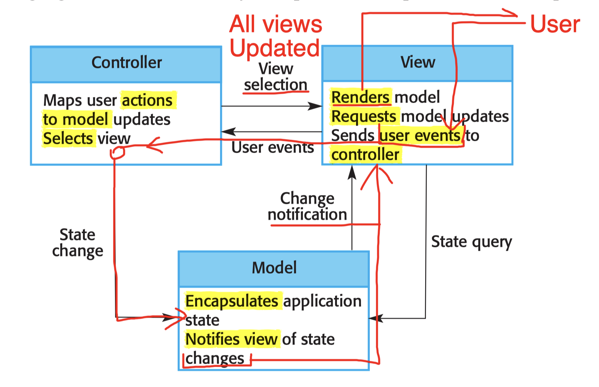
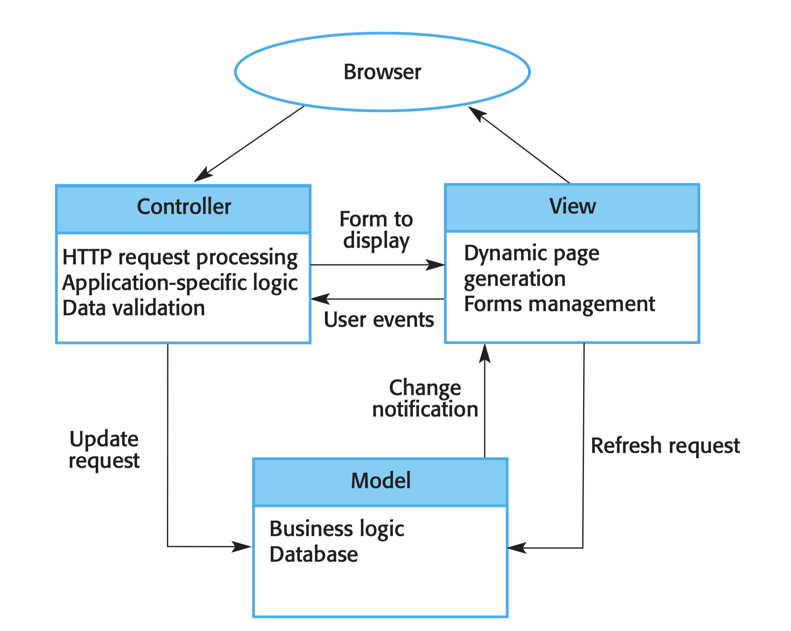

## 6.3 Architectural Patterns

- ***Patterns***: 
  - A way of **presenting**, **sharing**, and **reusing** knowledge about software systems.

- A stylized description of **good design practice**, which has been **tried** and **tested** in different systems and environments. 

Architectural patterns:
- The Model-View-Controller (MVC) pattern
- The Client-Server pattern
- The Pipe and Filter pattern
- The Layered pattern
- The Repository pattern

### 6.3.1 Model-View-Controller (MVC) Pattern

***Model***:
- Manages the system **data** and associated **operations** on that data.
  - Model the real world;
  - Should happen in the real world;

***View***:
- **Defines** and **manages** how the data is ***presented*** to the user.
  - For a java file: editing view, read-only view, class view, etc...

***Controller***: 
  - **Manages** user **interaction** (e.g., key presses, mouse clicks, etc.) and **passes** these interactions to the *View* and the *Model*.

</img>

</img>

---

Usage:
- Multiple ways to view and interact with data
  - editing view, read-only view, class view, etc
  - Changes in one view should be updated in other views;
- The future requirements for interaction and presentation of data are unknown. 
  - e.g., Course project: from CLI to GUI, no need to change the Model. 
- Views can be changed independently to the Model;

---

Advantage:
- Data to change independently of its representation and vice versa;
  - Weak coupling;
- Presentation of the same data in Advantages different ways

---

Disadvantage:
- Involve **additional** code and code **complexity**;
- Especially when the data model and interactions are simple.
