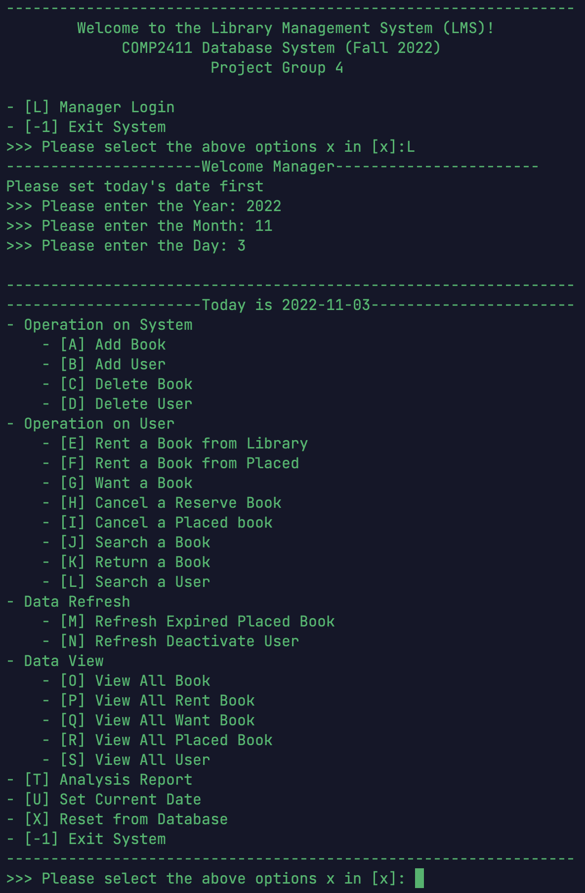

> ***Please carefully read the [Disclaimer of Liability](#disclaimer-of-liability) below first.***  
> All materials in this archive are for reference only. The actual one may vary. 

# Library Management System

> *A Group Project of Database Systems (COMP2411) subject at [The Hong Kong Polytechnic University](https://www.polyu.edu.hk/), made by [CHEN Derun](https://github.com/ShanpooO), [JIANG Guanlin](https://github.com/David200308), [KWOK Hin Chi](https://github.com/HaleyKwok), [LIU Minghao](https://github.com/David-Lmh), [YE Haowen](https://github.com/ShanYu0205), and [ZHANG Wengyu](https://github.com/zhangwengyu999), 2022-11-19*

## Group Members

- [CHEN Derun](https://github.com/ShanpooO) 
- [JIANG Guanlin](https://github.com/David200308) 
- [KWOK Hin Chi](https://github.com/HaleyKwok) 
- [LIU Minghao](https://github.com/David-Lmh)  
- [YE Haowen](https://github.com/ShanYu0205)   
- [ZHANG Wengyu](https://github.com/zhangwengyu999)

---

</img>

---

## Features

1. A book catalogue with search by name, author and category of the books.  Note there may  be more than one copy of each book, and a book may even be published by different  publishers. 
2. The ability to deactivate a patron’s account if he/she does not return books after a specific period of time passes. 
3. Records of books checked out as well as placed on hold (i.e. “reserved” by a patron to make sure the book is there when he/she gets to the library to check it out). 
4. Notifications when the desired book becomes available and reminders that a book should be returned to the library.  Both could be sent by email and/or when patron logs in to the LMS. 
5. Provide analysis report to management to review the system.

For detailed features, please refer to [Project Report](https://github.com/zhangwengyu999/Library_Management_System_Project/blob/main/Project_Report.pdf).

---

## User Guide

For detailed user guide, please refer to [User Guide](https://github.com/zhangwengyu999/Library_Management_System_Project/blob/main/User_Guide.pdf).

---

Copyright © [CHEN Derun](https://github.com/ShanpooO), [JIANG Guanlin](https://github.com/David200308), [KWOK Hin Chi](https://github.com/HaleyKwok), [LIU Minghao](https://github.com/David-Lmh), [YE Haowen](https://github.com/ShanYu0205), and [ZHANG Wengyu](https://github.com/zhangwengyu999) at [The Hong Kong Polytechnic University](https://www.polyu.edu.hk/). All rights reserved.

---

## Disclaimer of Liability

**The material and information contained on this website is for general information, reference, and self-learning purposes only. You should not rely upon the material or information on the website as a basis for making any academic, business, legal or any other decisions. You should not copy any material or information on the website into any of your academic, business, legal or any other non-private usages. ZHANG Wengyu will not be responsible for any consequences due to your violations.**

Whilst ZHANG Wengyu endeavours to keep the information up to date and correct, ZHANG Wengyu makes no representations or warranties of any kind, express or implied about the completeness, accuracy, reliability, suitability or availability with respect to the website or the information, products, services or related graphics contained on the website for any purpose. Any reliance you place on such material is therefore strictly at your own risk.

ZHANG Wengyu will not be liable for any false, inaccurate, inappropriate or incomplete information presented on the website.

Although every effort is made to keep the website up and running smoothly, due to the nature of the Internet and the technology involved, ZHANG Wengyu takes no responsibility for and will not be liable for the website being temporarily unavailable due to technical issues (or otherwise) beyond its control or for any loss or damage suffered as a result of the use of or access to, or inability to use or access this website whatsoever.

Certain links in this website will lead to websites which are not under the control of ZHANG Wengyu. When you activate these you will leave ZHANG Wengyu's  website. ZHANG Wengyu has no control over and accepts no liability in respect of materials, products or services available on any website which is not under the control of ZHANG Wengyu.

To the extent not prohibited by law, in no circumstances shall ZHANG Wengyu be liable to you or any other third parties for any loss or damage (including, without limitation, damage for loss of business or loss of profits) arising directly or indirectly from your use of or inability to use, this site or any of the material contained in it.

